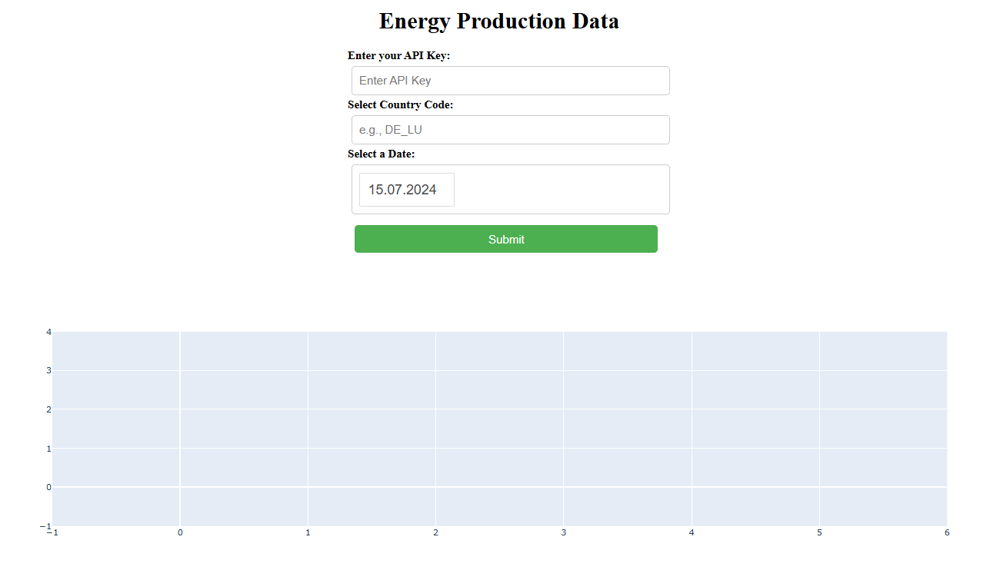
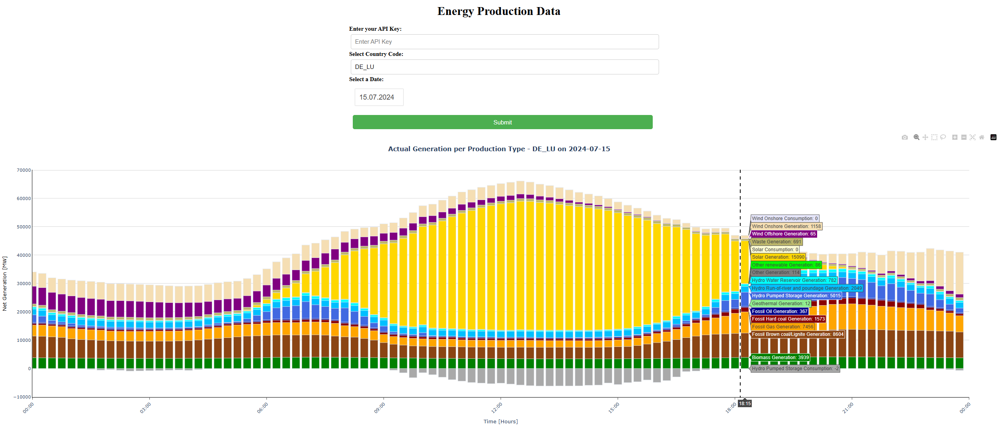

# Energy Production Data Visualization App

This Dash application allows users to visualize energy production and consumption data from the ENTSO-E API. Users can input their API key, select a country code, and choose a date to fetch and display the energy data in an interactive stacked bar chart.

## Features

- **API Integration**: Connects to the ENTSO-E API to fetch energy generation and consumption data.
- **Interactive UI**: Users can input their API key and select parameters to customize their data view.
- **Data Visualization**: Displays data in an intuitive stacked bar chart format, with options to view generation and consumption data clearly.

## App Appearance

The application features a clean and user-friendly interface that allows users to easily input their parameters and view the results.



## Example Graphs

Upon submitting the parameters, the app generates a stacked bar chart displaying energy production and consumption data for the selected country and date. 



## Getting Started

### Prerequisites

To run this application, you will need:
- Python 3.x
- Dash
- Plotly
- Pandas
- pytz
- entsoe

## Installation

1. Clone the repository:
   ```bash
   git clone https://github.com/[yourusername]/[your-repo].git
   cd [your-repo]
2. Install the required packages:
   ```bash
   pip install dash plotly pandas pytz entsoe
   ```

### Usage

1. Obtain an API key from the ENTSO-E website.
2. Run the application:
   ```bash
   python app.py
   ```
3. Open your web browser and go to `http://127.0.0.1:8050`.

### Input Parameters

- **API Key**: Required to access the ENTSO-E API.
- **Country Code**: The country code for which you want to fetch energy data (e.g., DE_LU for Germany and Luxembourg).
- **Date**: Select a date to view energy data for that specific day.

### Example

- Enter your API key: `your_api_key_here`
- Country code: `DE_LU`
- Date: Select from the date picker

### License

This project is licensed under the MIT License - see the [LICENSE](LICENSE) file for details.

### Acknowledgments

- [ENTSO-E](https://www.entsoe.eu/) for providing the API and data resources.
- [Dash](https://dash.plotly.com/) for the framework used to create the app.
- [Plotly](https://plotly.com/python/) for the graphing library used for visualizations.
